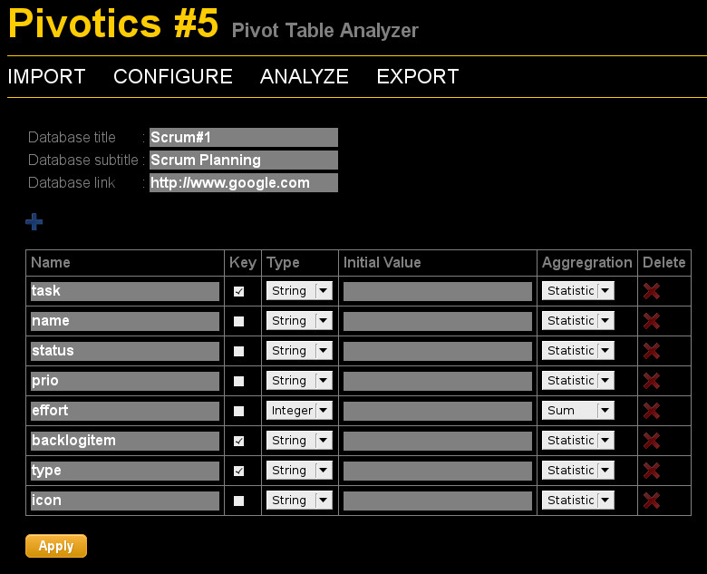
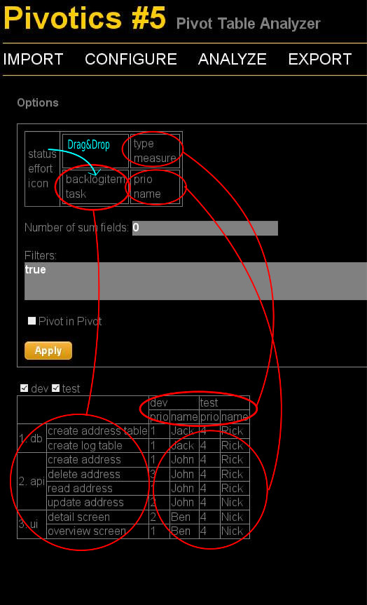
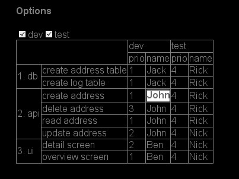
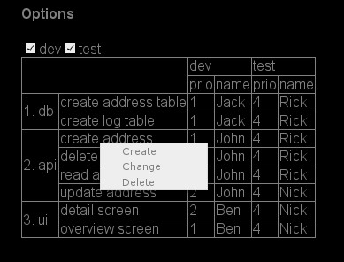
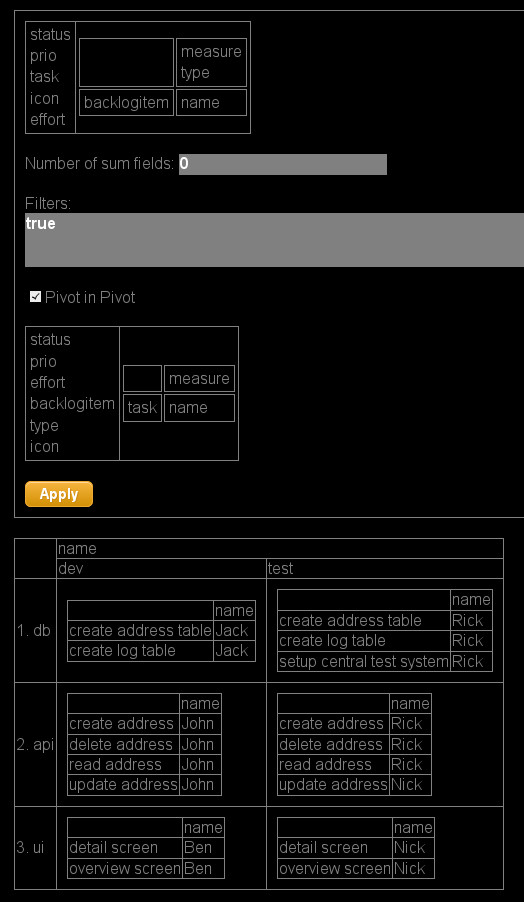
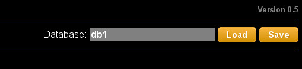

<!--

rechtschreibkorrektur
-->

# TOC

* [Introduction](#introduction)
* [History](#history)
* [Browser Support](#browsersupport)
* [Installation](#installation)
* [Import](#import)
* [Configure](#configure)
* [Analyze](#analyze)
* [Loading and Storing the Database](#loadsave)
* [Export to CSV](#export)
* [CSS](#css)

# Introduction 

*Pivotics* is a HTML5 based [pivot table](http://en.wikipedia.org/wiki/Pivot_table) editor. It allows you to

* Import CSV data
* Configure the imported data, especially
 * Configure the data types of the imported columns
 * Set an aggregation function
 * Define key fields
* Analyze the imported data by defining table views.
 * Define table views by distributing fields on rows and columns
 * Aggregate (for instance sum) columns
 * Edit the data
 * Create new table lines
 * Use icons in columns
 * Filter data			
* Export to CSV
* *Pivotics* includes a simple python based webserver which you can use in your local network for loading and storing data. Optionally you can use also your own webserver. 
* The state of the *Pivotics* UI is stored in the URL so you can easly send links to other people.

*Pivotics* also has some drawbacks you should now:

* It is not designed for a huge amount of data. I tested it with up to 500 records and about 10 attributes per record.
*Pivotics* is a HTML5 based application which means that all the application logic is running in javascript in your browser.
Whenever you change a table cell or create a new record there is a full table rendering roundtrip. Actually for my 500 records database
I oberserve no lag of time but for larger datasets this will happen.
* Im am a technician an actually hate to develop UIs. So regarding usability *Pivotics* may be suboptimal.

[Pivot tables](http://en.wikipedia.org/wiki/Pivot_table) are a great and well known concept in [OLAP](http://en.wikipedia.org/wiki/Online_analytical_processing).

Also if you don't like *Pivotics* I encourage you to test the pivot table implementation in [Microsoft Excel](http://office.microsoft.com/en-us/excel-help/pivottable-reports-101-HA001034632.aspx) or in [Open Office](http://openoffice.blogs.com/openoffice/2006/11/data_pilots_in_.html).

# History 

Some years ago my software company decided to switch to scrum development mode. The company offered
some scrum software tools for project management. Unfortunately and as expected it turned out that all the tools
were not suitable for the scrum approach in my team. This may not due to the quality of the software
but perhaps my team was too agile for these tools: 

* Typically the tools offer the possibility to categorize
the development jobs by backlog items and tasks. In practice we noticed that this hierarchy is too inflexible.
Sometimes you only need two hierarchy levels for categorization sometimes it is three or four.
* We also
observed that a single development task has several aspects: So for each eask task there is development and testing.
Sometimes you want to support multiple technologies or platforms which adds another dimension to the scrum planning
schema.
* Developers hate administration task. In the scrum tools offered by my company it took severaly mouse clicks to confirm a task.
So developers tend to boycott the tools.

In order to overcome these problems I developed *Pivotics* a HTLM5 based tool for configuring and editing pivot tables.
In fact this is not a pure scrum tool instead it allows you to create and edit arbitrary column based data (like a database table) and
to define own table views on this data.
Whether you use the tools for scrum planning, organizing your private TODO, or maintain the shopping list of your girlfriend is up to you.

# Browser Support

*Pivotics* relies on HTML5. It does work well with Firefox and Chrome. I have no glue whether it does work in Internet Explorer.

# Installation

## Using Included Python Webserver

Ensure that [Python 2](http://www.python.org/) is installed.

Download <a href="https://github.com/os69/pivotics/archive/master.zip">Pivotics</a> and unzip the archive. Switch to 
the pivotics directory and start the included python based webserver by

    python server/server.py

Open 

    http://localhost:51000/app/pivotics.html
	
in your webbrowser. Do not connect this webserver to the public internet. 
This server is highly insecure an could expose your complete filesystem to the public!

## Custom Webserver
Instead of using the included webserver you can also extract the archive in www directory of a professional 
web server. This should work for all GET requests. *Pivotics* uses a POST request to store data on the server. Probably you need
to enable  POST requests in your webserver configuration.

# Import
In the *Pivotics* toolbar choose IMPORT. Select a CSV file. You can find an example file in  

    pivotics/data/test1.csv. 

Then press the upload button.
You should get a message which informs you about the number of imported records.

# Configure

In the *Pivotics* toolbar choose CONFIGURE. You will get a list of all the columns of your dataset.
The test data set contains an example for doing a small scrum planning. 

<table>
<thead>
<tr> <th>Column</th><th>Description</th>
</thead>
<tbody>
<tr><td>backlogitem</td><td>Main category of development tasks</td></tr>
<tr><td>task</td><td>Task within a backlog item</td></tr>
<tr><td>type</td><td>Type of the task, for instance dev=development or test=create test case</td></tr>
<tr><td>name</td><td>Responsible developer</td></tr>
<tr><td>status</td><td>Status like open or finished</td></tr>
<tr><td>prio</td><td>Priority 1,2,3...</td></tr>
<tr><td>effort</td><td>Effort</td></tr>
<tr><td>icon</td><td>test column for demonstrating how to include icons into a table</td></tr>
</tbody>
</table>

Here is a suggestion how to configure the columns:

## Key Fields
You can set a checkbox for each keyfield. *Pivotics* will ensure that there are no records with identical key.
## Type
Currently the following types are supported: String, Integer, Float and Icon. By using the type icon
you can display icons in columns. 
## Initial Value
Does allow you to define an initial value which for instance is relevant when creating new records.
## Aggregation
The following aggregation functions are supported:

* Sum: Calculates the sum of columns. Only useful for type Integer or Float.
* Statistic: Create a statistic. For each value of a column you will get the number of records with this value.
* List: String concatenation of all columns, separator is line break.

# Analyze
In the *Pivotics* toolbar choose ANALYZE. You will get the calculated default view of your data wich probably looks ugly.

## Configure the Table View
You can configure the table view in the options dialog. Move fields to the rows, columns or cells area by drag & drop.
Drag & Drop is a little bit fiddly. You may need to move the mouse carefully to find out the right drop area.
After choosing apply you will see the result table below. You can close the options dialog by clicking on options.
Rows and Columns work in an identical way: Think of an coordination system with two axis: row and column axis.
On each axis the field values are sequentially arranged. In case you put more than one field on an axis you will
get a nested structure. Values of cell fields are aggregated and displayed in the center area. Pivot tables are
a powerful tool but a little bit difficult to explain. So I suggest that you play a little bit with the configuration
dialog in order to find out whats behind.

You may have noticed that there is a special field name 'measure' in the column area. This field is only relevant if
there is more than one field in the cell area. For testing you may put 'measure' on rows. You will notice that
the cell fields are now listed sequentially on rows.

Some functionalities like creating new records will only work if 'measure' is in the column area.

## Change fields
You can change fields by clicking on a table entry of the rows, columns or cells area.

## Create, Change or Delete Records
You can create, change or delete records by the context menu.

## Filtering
Records can be filtered by entering Javascript expressions into the filters fields. This is not very
user friendly but on the other hand it is powerful. For instance:

    this.type==="dev"

will restrict the records to those of type development.
	
## Subtotals
Enter a number into the Number of sum fields field to get subtotals. The number determines on how many levels you will get the subtotals.
	
## Pivot in Pivot
Sometime it is useful to have a pivot table within a pivot table. In the scrum example a typical use case 
are tasks only occuring in the test area (central test and review meeting in the example). Without pivot in pivot
you could end with a lot of empty columns.

## Icons
In case the datatype of the column is icon the value is displayed by a icon. Enter one of the following value

    1_ok
    2_warning
    3_error

In case you want to add own icons place them in folder app/images.   
  
## Table layout and URL
The table layout is stored in the URL. So you can send the URL via email. The receiver should get the identical table layout. 

# Loading and Storing the Database
You can load and save data sets. The data is stored in JSON format. The data file includes a version number. 
When using the included webserver there is a rudimentary protection preventing data loss when concurrently
saving by different users: The first user will win and the second user will get an error message. Actually 
there should be a merge and conflict resolution mechanism but is not. When using your own webserver you
need to use your own mechanism for ensuring data consistency (maybe by a PHP request handler).

# Export to CSV
In the *Pivotics* toolbar choose EXPORT to export your data set to CSV.

# CSS
By default *Pivotics* uses a dark theme (black.css). You can specify alternative CSS file in the URL, for instance
   
    ...&css=white.css

